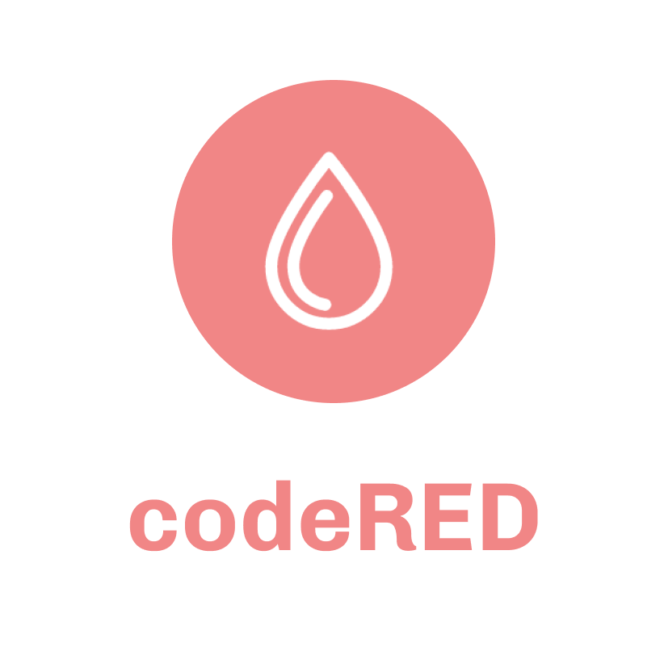
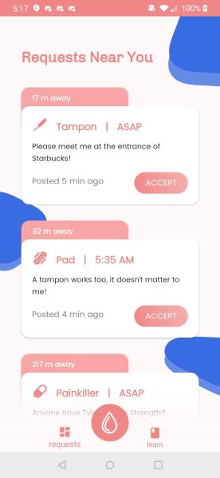
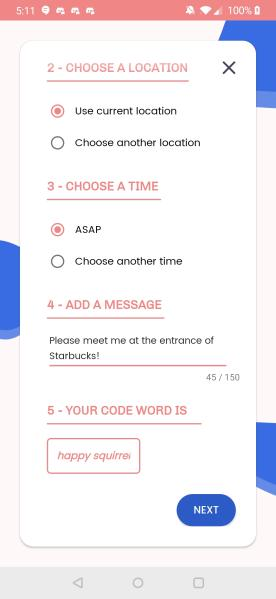
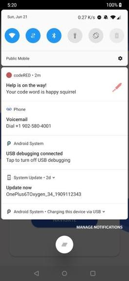
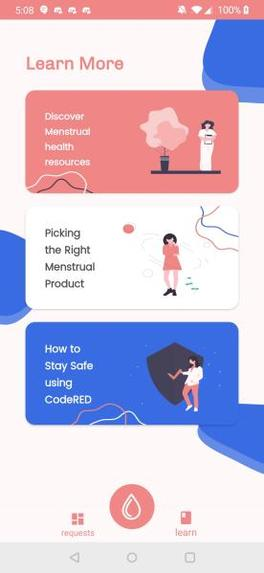
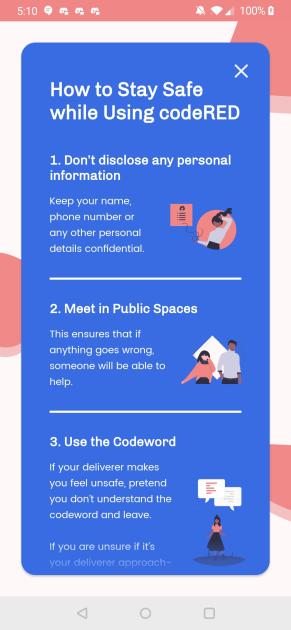

   

### About
codeRED is an Android app that promotes equal access to period products, by creating a platform to share and request resources from users near you. As women, our team can sympathize with the awkwardness of forgetting your period essentials, not knowing where to get them or being too embarrassed to ask. Through the generosity of strangers, codeRED can anonymously connect women for an exchange of sanitary products (pads, tampons) or painkillers. This app also helps transgender men and individuals experiencing period poverty (the lack of basic female hygiene products), who may be uncomfortable asking for help.

By filling out a request form in the app, the user can easily ask for a product, and set a time, location, and an optional message for receiving it. This can be done completely anonymously and the user can even request a contactless exchange, such as leaving a tampon under the third stall of a Walmart washroom. Although we want to implement anonymity, we do recognize that safety is incredibly important. If the user chooses to meet up, there is a randomly generated codeword which is used to confirm the identity of the other user. If the person seems potentially dangerous, the user can ignore the codeword and walk away without consequence.

To help others when they are in need, there is a ‘Requests Near You' screen, which displays pending requests sent within the past 30 minutes, and that are within a one-kilometre radius. It is sorted by distance and time, and app notifications are sent to users within 200m, whenever a new request is added. If a user accepts the request, the sender will be notified and the request will be marked as completed!

Along with the providing and requesting of period products, codeRED has a “Learn” page providing educational resources on choosing sanitary products, menstrual health, and how to stay safe while using codeRED - in hopes of empowering women, transmen, and those suffering from homelessness to take control of their own health as well as fostering a supportive community.

**1st Place at MLH Hack Girl Summer**

### Quick Preview
Here's a glimpse into what it looks like!   

### Contributing
Please feel free report bugs and add any ideas you like!

